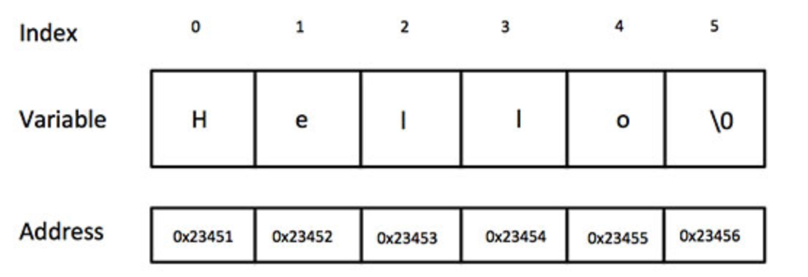

# 字符串

> 在c语言中,字符串实际上是使用`null`字符`\0`终止的一维字符数组. 因此, 一个以`null`结尾的字符串,包含了组成字符串的字符.


下面的声明和初始化创建了一个'Hello'字符串,由于在数组的末尾存储了空字符串,所以字符数组的大小比单词'Hello'的字符数多一个.
```c
    char greeting[6] = {'H','e','l','l','o','\0'};
```
等价于
```c
    char greenting[] = "Hello";
```

c/c++中定义的字符串的内存表示:



不需要把`null`字符放在字符串常量的末尾.c编译器会在初始化数组时,自动把`\0`放在字符串的末尾.


|序号|函数&目的|
|:---|:---|
|1| strcpy(s1, s2); 复制字符串 s2 到字符串 s1。|
|2| strcat(s1, s2);连接字符串 s2 到字符串 s1 的末尾。|
|3| strlen(s1);返回字符串 s1 的长度。|
|4| strcmp(s1, s2);如果 s1 和 s2 是相同的，则返回 0；如果 `s1<s2` 则返回小于 0；如果 `s1>s2` 则返回大于 0。|
|5| strchr(s1, ch);返回一个指针，指向字符串 s1 中字符 ch 的第一次出现的位置。|
|6| strstr(s1, s2);返回一个指针，指向字符串 s1 中字符串 s2 的第一次出现的位置。|
